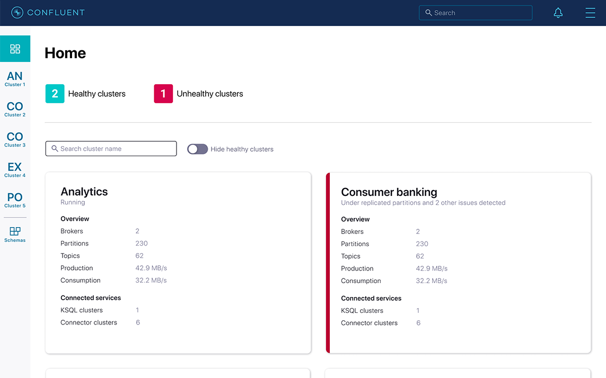
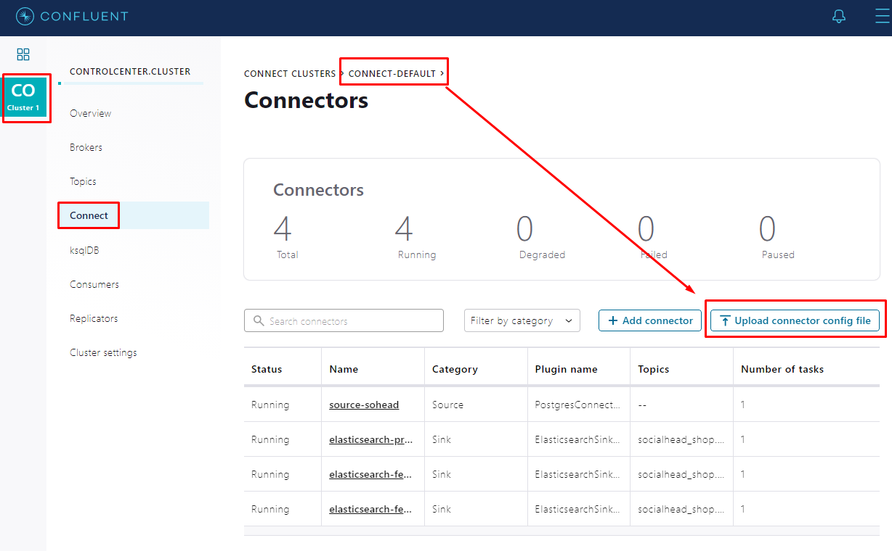
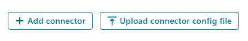
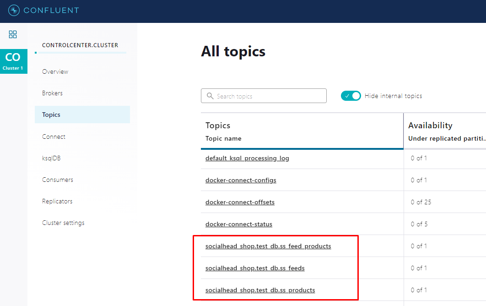

# Config Kafka Connection

Ở phần này mình sẽ tìm hiểu sâu hơn xíu về cách cấu hình Kafka Connector.

Trước khi bắt đầu, bạn nào chưa nắm sơ lược về Kafka thì có thể xem lại thêm [tại đây](./article.md) nha.

Tóm lại: `Apache Kafka® is an event streaming platform` (Mình mạn phép giữ nguyên thể Tiếng Anh)


Nhìn vào kiến trúc Kafka như trên thì rất dễ hiểu nhưng cấu hình để nó hoạt động thì mình gặp muôn vàn khó khăn, hiện tại ở lúc viết bài này mình chỉ có thể cấu hình được cho hệ thống chạy thử chứ chưa chạy ổn định được. Tức là mình sẽ tập trung vào phần cấu hình các connector, chứ chưa đụng đến phần `load balancing` nhé.

## Chuẩn Bị

Bài viết này mình sẽ cấu hình với mô hình sau:

```
<PostgreSQL> ======> <Kafka> ======> <Elastic Search>
```
Mình muốn khi cập nhật dữ liệu (create update delete - CRUD), thì hệ thống phải cập nhật lại `Elastic Search` service, để phục vụ cho hệ thống tìm kiếm, làm report... Vậy để làm được như trên thì mình cần phải có các server bên dưới:

```
- broker         0.0.0.0:9092->9092/tcp, 0.0.0.0:9101->9101/tcp
- connect        0.0.0.0:8083->8083/tcp, 9092/tcp
- postgres       0.0.0.0:5432->5432/tcp
- zookeeper      0.0.0.0:2181->2181/tcp, 2888/tcp, 3888/tcp
- elasticsearch  0.0.0.0:9200->9200/tcp, 0.0.0.0:9300->9300/tcp
```

Mình đã gặp rất nhiều khó khăn khi bắt đầu mọi thứ từ con số `0`. Vì không có người hướng dẫn, và mọi thứ phải dùng `command line`. Vì config quá cực và không hiệu quả nên mình phải dùng đến Web UI để config, đó là lúc mình biết đến [Confluent](https://www.confluent.io/). Họ cung cấp cho mình platform để config mọi thứ trực quan hơn. Tiện thể, để review elastic search dễ hơn thì mình dùng đến [Kibana](https://www.elastic.co/kibana)

```
- kibana         0.0.0.0:5601->5601/tcp
- control-center 0.0.0.0:9021->9021/tcp // Confluent Platform UI
```




## Cấu Hình

Ở phần trước, mình có đề cập đến các `producer` và `consumer`. Nhưng trong bài toán cụ thể này, để giải quyết bài toán về truyền tải dữ liệu real time từ `postgreSQL` sang `elastic search` mình tạm gọi `producer` và `consumer` là các `Data Repositories`. Cụ thể hơn:

```
Producer ==>  Data Source
Comsumer ==>  Data Sink
```

Sau khi cài đặt và bật các services xong, bạn vào đường dẫn `http://localhost:9021` để vào giao diện Confluent và cấu hình các `connector
`



Tại sao chỉ cần cấu hình các `connector` ? Vì với Confluent thì khi start các services, thì chúng gần như đã connect với nhau, mình chỉ tập trung vào cấu hình phần điều phối dữ liệu `stream event` thông qua các `connector`


`Connector` là các cụm server mà trong đó mình sẽ thiết lập các connection thông qua các `library`, Ví dụ: Debezium của RedHat. Và để tối giảm tài nguyên, nên trong bài viết này mình chỉ dùng 1 instance dùng chung để connect các `Source` và `Sink` connectors.


`Confluent` có hỗ trợ cấu hình các connectors bằng UI hoặc json file. Trước khi bắt đầu giải thích các thông số trong file cấu hình, bạn cần chắc chắn 2 điều để file này có thể `valid` trước khi submit.

- `Database server` phải enable log mod: Ví dụ: Redo Log (e.g. Oracle), Binary Log (e.g. MySQL), or Write-Ahead Logs (e.g. PostgreSQL).
- `Connector` server phải chứa các library hỗ trợ các connection. Trong bài viết này mình sẽ dùng 2 thư viện chính

  - Source connector library: `debezium/debezium-connector-postgresql:latest`. Các bạn có thể tham khảo [tại đây](https://docs.confluent.io/debezium-connect-postgres-source/current/index.html).
  - Sink connector library: `confluentinc/kafka-connect-elasticsearch:latest`. Các bạn có thể tham khảo [tại đây]( https://docs.confluent.io/kafka-connect-elasticsearch/current).



### Source Connector (Producer)

```json
// source_sohead_connector.json

{
  "name": "source-sohead",
  "config": {
    "connector.class": "io.debezium.connector.postgresql.PostgresConnector",
    "database.server.name": "socialhead_shop",
    "database.hostname": "postgres",
    "database.user": "postgres",
    "database.password": "postgres",
    "database.dbname": "test_db",

    "transforms": [
      "key",
      "route"
    ],
    "transforms.key.type": "org.apache.kafka.connect.transforms.ExtractField$Key",
    "transforms.key.field": "id",
    "transforms.route.type": "org.apache.kafka.connect.transforms.RegexRouter",
    "transforms.route.regex": "([^.]+)\\.([^.]+)\\.([^.]+)",
    "transforms.route.replacement": "$1.test_db.$3",

    "table.include.list": [
      "public.ss_feeds",
      "public.ss_feed_products",
      "public.ss_products"
    ],
    "column.include.list": [
      "public.ss_feeds.id",
      "public.ss_feeds.shop_id",
      "public.ss_feeds.user_id",
      "public.ss_feeds.status",
      "public.ss_feeds.social_type",
      "public.ss_products.id",
      "public.ss_products.shop_id",
      "public.ss_products.internal_id",
      "public.ss_products.user_id",
      "public.ss_feed_products.id",
      "public.ss_feed_products.ss_feed_id",
      "public.ss_feed_products.ss_product_id",
      "public.ss_feed_products.status"
    ]
  }
}
```

Khi submit file này, Confluent sẽ tạo ra connection kèm các `topics` message. Dựa vào các topics này, chúng ta sẽ kết nối với các `sink` connection.

- `connector.class`: Tên thư viện chúng ta dùng để connect các data repositories. Khi sử dụng các `lib` này, chúng ta phải khai báo thêm các thông tin liên quan, trong trường hợp này là `database.*`, `table.include.*`, `column.include.*`, ... các bạn có thể tham khảo tại link các bạn cài `lib`

- `database.server.name`: Các bạn phải đặt tên cho các database server, vì `lib` này sẽ dùng tên này mà đặt tên cho default `topic` theo cấu trúc: `<db-server-name>.<schema>.<table>`



- `transforms`: Đây là phần rất quan trọng và không thể thiếu trong các conncetion. Nó giúp mình sửa các thông số/data mặc định trước khi dữ liệu được truyền đến `brokers`. Mình có thể đặt tên cho các transform mà mình muốn định nghĩa. Trong trường hợp này mình đã dùng `ExtractField$Key` transforms (đặt tên `key`) và `RegexRouter` transforms  (đặt tên `route`)

  - ExtractField$Key: Các bạn đọc tài liệu để hiểu rõ hơn nha. Túm lại là dữ liệu từ source truyền vào broker sẽ theo định dạng `key:value`. Key có thể là chuỗi cấu trúc, và value cũng vậy. Mình transform này để định danh `key` tường minh hơn, bằng cách chỉ lấy giá trị `id` trong `key`. Lưu ý: Key có thể là `null` nhé.
    
    ```
    Key before: struct({id:99})
    Key After: 99
    ```

  - RegexRouter: Mình dùng tranform này để định danh lại topic name theo pattern.
    
    ```
    Topic before: socialhead_shop.public.ss_products
    Topic After: socialhead_shop.test_db.ss_products
    ```

- `table.include.list`: Connection này sẽ lắng nghe mọi thay đổi trong db của bạn để tạo ra các event message và truyền đến broker. Tuy nhiên, mình chỉ monitor một số bảng thôi.

- `column.include.list`: Mình chỉ muốn nội dung event message chứa các thông tin một số cột thôi, nhằm tránh dư thừa dữ liệu.

Lưu ý: Để dễ maintain, bạn có nghĩ sẽ tách file này làm 3. Mỗi file chỉ cấu hình 1 table tương ứng với 1 topic duy nhất không? KHÔNG NHÉ => Hệ thống sẽ báo lỗi trùng `DB Connection`.

## Sink Connector (Consumer)

Bên dưới là file cấu hình để lắng nghe event từ event `socialhead_shop.test_db.ss_feeds` sau đó update vào elastic search service với index là `ss_feeds`

```json
// sink_feeds_connector.json

{
  "name": "elasticsearch-feeds",
  "config": {
    "topics": "socialhead_shop.test_db.ss_feeds",

    "connector.class": "io.confluent.connect.elasticsearch.ElasticsearchSinkConnector",
    "connection.url": "http://elasticsearch:9200",
    "type.name": "_doc",
    "behavior.on.null.values": "delete",

    "transforms": [
      "route",
      "unwrap"
    ],
    "transforms.route.type": "org.apache.kafka.connect.transforms.RegexRouter",
    "transforms.route.regex": "([^.]+)\\.([^.]+)\\.([^.]+)",
    "transforms.route.replacement": "$3",
    "transforms.unwrap.type": "io.debezium.transforms.ExtractNewRecordState",
    "transforms.unwrap.drop.tombstones": "false"
  }
}
```

- `topics`: Tên các topics mình muốn monitor để trigger event.

- `connector.class`: Vì mình đang dùng `ElasticsearchSinkConnector` lib nên mình phải khai báo kèm các thông số elastic search server. 

- `behavior.on.null.values`: Giá trị default của fiel này là `ignore`. Ý nghĩa là với các message null từ broken mình sẽ không làm gì. Giá trị null được gởi khi bạn xóa dữ liệu trong database. Điều này có nghĩa là khi bạn xóa 1 record trong db, thì elastic search sẽ không update. Nên mình bật là `delete` để elastic search xóa dữ liệu này luôn.

- `transforms`: Trong trường hợp này mình đã dùng `RegexRouter` transforms (đặt tên `route`) và `ExtractNewRecordState` transforms (đặt tên `unwrap`)

  - RegexRouter: Khi thiết lập connector này. Hệ thống sẽ tạo 1 index trên elastic search. Mình dùng transform này để thay đổi default index trong elastic search.
    
    ```
    Index before: socialhead_shop.test_db.ss_feeds
    Index After: ss_feeds
    ```

  - ExtractNewRecordState: Mình dùng tranform này để thay đổi cấu trúc dữ liệu trước khi truyền đến elastic search.
    
    ```
    Data before: 
      {
        "schema":{
          ...
        },
        ...
        "payload":{
          ...
        }
      }
        
    Data After: 
      {
        "id": "99:58:4800289800236:33107337674796",
        "ss_feed_id": 99,
        "ss_product_id": "58:4800289800236",
        "status": "ACTIVATED",
      }
    ```

## References
- https://docs.confluent.io/kafka-connect-elasticsearch/current/
- https://docs.confluent.io/debezium-connect-postgres-source/current/index.html
- https://www.javierholguera.com/2020/06/02/kafka-connect-offset-commit-errors-i
