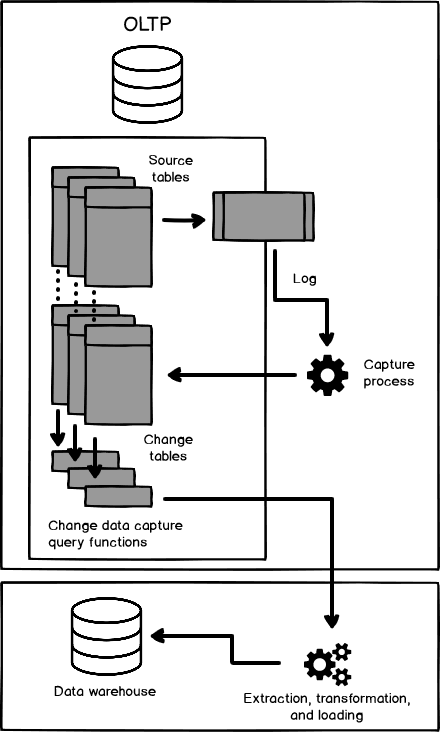
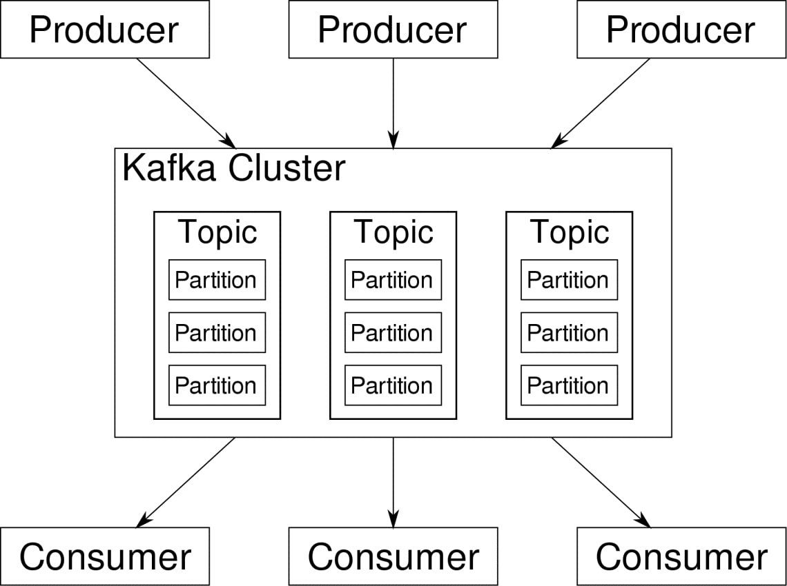
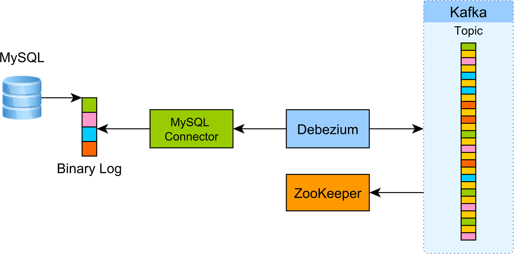

# FireApps Gia Trang vs Di Hồn Đại Pháp (Change Data Capture)

> Trước khi bắt đầu, mình xin nhấn mạnh mình không chuyên về DB, và mình chỉ RnD trong vài ngày. Nên bài viết mang tính chia sẽ và tiếp thu trên tinh thần xây dựng, mong các đồng môn nương tay tương trợ. Xin cảm ơn ^ ^.

- Source code Demo: https://github.com/minhlong/sync-postgresql-with-elasticsearch-example

Chuyện là giữa thời loạn lạc, âm binh Covid hoành hành, khiến cho dân tình bất ổn phải cách ly tại nhà. Làm cho người người phải đổ sô livestream các kiểu đồ để mưu sinh, khiến cho Shopping phát triển thần kì. Nhà nhà giờ đây đã gần gũi hơn với việc mua sắm online... và điều này đã gây trấn động tới FireApps Gia Trang...

FireApps Gia Trang vốn là bản doanh của các thương nhân lớn nhỏ, nơi có thể giúp các chư vị chèo lái, tiếp cận khách hàng 24/24 không ngừng nghĩ nhờ hệ thống mà tại hạ đang làm... Do nhu cầu thương nhân tăng cao nên hệ thống cần phải được nâng cấp để xứ lý các lưu lượng dữ liệu liên tục không dừng (Streaming)

## Đặt Vấn Đề


Hiện tại, tại hạ đang có 1 hệ thống (web application) để lưu trữ và xử lý dữ liệu như mô hình bên trên. Nhưng với mô hình này, chúng mình bị gặp rất nhiều vấn đề về xử lý Big Data.
- Đồng bộ hóa dữ liệu.
- Truy vấn dữ liệu lớn.
- v.v...

Mình có tham khảo một số bạn thì có các giải pháp như sau:

- Tăng xử lý bên phía Web Application
    - Queue - Worker
    - Docker - Kubenetes
    - v.v...
- Scale up DB service
    - Sharding DB

Với cách xử lý trên, chúng mình có thể giải quyết được bài toán lưu trữ, truy vấn dữ liệu. Nhưng liệu nó có đáp ứng được nhu cầu tìm kiếm và xử lý dữ liệu lớn.

Ví dụ: Tôi muốn mỗi record A khi insert vào DB. Ngoài việc thêm vào DB x, nó còn phải được clone và tính toán lại (processing) sau đó cập nhật vào DB y. Lúc này đa số sẽ có 2 giải pháp sau:

- Hoặc là đặt xử lý ở web application, khi thêm A vào x, thì xử lý luôn và thêm A vào y.
- Hoặc là dùng DB TRIGGER để tạo các procedures.

Cả 2 mô hình trên đều ổn nhưng mình gặp không ít về vấn đề bảo trì, nếu đặt bên phía web application thì phải handle rất nhiều chỗ, rồi nếu xử lý xót thì sao ? Hoặc khi dev nghĩ, hoặc dev mới vào ... thì biết chỗ đâu mà lần? Nếu dùng DB TRIGGER thì performance của DB sẽ không cao. Nghĩa là lúc này, mình cần structure lại hệ thống, tức là mình cần 1 cụm service để chuyên xử lý dữ liệu mà không ảnh hưởng nhiều đến web application (maintain) hoặc DB (performance).

## Giải Quyết Vấn Đề 

> Xin nhấn mạnh lại là mình không chuyên về DB nha ^ ^ Nên có gì các đồng môn góp ý thêm nhé.

Sau một hồi google thì mình biết đến 2 thứ:
- Một là `Change Data Capture` (CDC)
- Một là `Kafka` Service

> Change Data Capture: Theo mình hiểu thì các hệ quản trị cơ sở dữ liệu như MySQL, PostgreSQL, Mongo... đều có chế ghi log khi tương tác với dữ liệu. Ví dụ: Redo Log (e.g. Oracle), Binary Log (e.g. MySQL), or Write-Ahead Logs (e.g. PostgreSQL). Change Data Capture dựa vào các log file này để transfer data đến các service khác.



> `Kafka` Service hoạt động giống như chat room vậy, có `producer` đống vai trò như như người gởi, và consumer đóng vai trò như người nhận thư, các `topic` đóng vai trò như các phòng chat, và `data` đóng vai trò như message gởi đi vậy.



> Các bạn chịu khó google xíu về Debezium, Kafka, ZooKeeper , ElasticSearch heng, mình không ghi ở đây vì rất dài và đỡ loãng bài.

Dựa vào cơ chế CDC và Kafa trên thì ta có mô hình như bên dưới.
- Producer lúc này sẽ là các CDC source
- Consumer lúc này sẽ là các processing service (Ví dụ: `ElasticSearch`)

Khi CDC bắt được các log thay đổi sẽ đẩy dữ liệu này đến Kafka service, và Kafka khi nhận được các trigger event sẽ đẩy đến các consumer (streaming - realtime).


Yeah... Vậy là done rồi, việc giờ chúng ta cần làm viết các lớp Producer/Consumer thôi, hay nói đúng hơn là các `connector` services. Nhưng thật may mắn, vì trên thế gian đã có các anh hùng bàn phím viết sẵn rồi, mình chỉ việc dùng thôi. Đơn cử chúng ta có Debezium. 

`Debezium` là một dự án mã nguồn mở của RedHead, nó cho phép chúng ta triết xuất dữ liệu với cơ chế CDC và chuyển hóa đến Kafa service. Hoặc transform dữ liệu từ kafka đến các processing service thông qua `topic`.



### Connector Config Demo
```sh
# setup connections
curl -i -X POST -H "Accept:application/json" -H  "Content-Type:application/json" http://localhost:8083/connectors/ -d @reqs/connections/es-sink-users.json
curl -i -X POST -H "Accept:application/json" -H  "Content-Type:application/json" http://localhost:8083/connectors/ -d @reqs/connections/es-sink-posts.json
curl -i -X POST -H "Accept:application/json" -H  "Content-Type:application/json" http://localhost:8083/connectors/ -d @reqs/connections/es-sink-comments.json
curl -i -X POST -H "Accept:application/json" -H  "Content-Type:application/json" http://localhost:8083/connectors/ -d @reqs/connections/source.json

```

- Producer file @reqs/connections/source.json
```json
{
  "name": "test_db-connector",
  "config": {
    "connector.class": "io.debezium.connector.postgresql.PostgresConnector",
    "tasks.max": "1",
    "database.hostname": "postgres",
    "database.port": "5432",
    "database.user": "postgres",
    "database.password": "postgres",
    "database.server.id": "184054",
    "database.dbname": "test_db",
    "database.server.name": "dbserver1",
    "database.whitelist": "test_db",

    "database.history.kafka.bootstrap.servers": "kafka:9092",
    "database.history.kafka.topic": "schema-changes.test_db",
    
    "transforms": "route",
    "transforms.route.type": "org.apache.kafka.connect.transforms.RegexRouter",
    "transforms.route.regex": "([^.]+)\\.([^.]+)\\.([^.]+)",
    "transforms.route.replacement": "$3"
  }
}
```

- Consumer file @reqs/connections/es-sink-users.json
```json
{
  "name": "es-sink-users",
  "config": {
    "connector.class": "io.confluent.connect.elasticsearch.ElasticsearchSinkConnector",
    "tasks.max": "1",
    "topics": "users",
    "connection.url": "http://elasticsearch:9200",
    "transforms": "unwrap,key",
    "transforms.unwrap.type": "io.debezium.transforms.UnwrapFromEnvelope",
    "transforms.unwrap.drop.tombstones": "false",
    "transforms.unwrap.drop.deletes": "false",
    "transforms.key.type": "org.apache.kafka.connect.transforms.ExtractField$Key",
    "transforms.key.field": "id",
    "key.ignore": "false",
    "type.name": "_doc",
    "behavior.on.null.values": "delete"
  }
}
```

## Kết Bài

Mô hình cuối cùng của hệ thống sẽ như sau:
- Ưu: Không có gì để bản.
- Nhược: Phải config khá nhiều thứ.


## Kết Mở
- Nếu không dùng Kafka có được không ?
- Không dùng CDC có được không ?
- Không dùng ZooKeeper có được không ?

## Errors
```
# Fix Docker Elastic Search error when starting
$ docker-compose logs elasticsearch
$ sudo sysctl -w vm.max_map_count=262144
```

## References
- https://github.com/YegorZaremba/sync-postgresql-with-elasticsearch-example
- https://dev.to/thiagosilvaf/how-to-use-change-database-capture-cdc-in-postgres-37b8
- https://www.confluent.io/blog/bottled-water-real-time-integration-of-postgresql-and-kafka/
- https://vladmihalcea.com/how-to-extract-change-data-events-from-mysql-to-kafka-using-debezium/
- [Simple config consumer and producer](https://kafka-tutorials.confluent.io/kafka-console-consumer-producer-basics/kafka.html)
- [Sink config options](https://docs.confluent.io/kafka-connect-jdbc/current/sink-connector/sink_config_options.html)
- [Confluent transform](https://docs.confluent.io/platform/current/connect/transforms/overview.html)